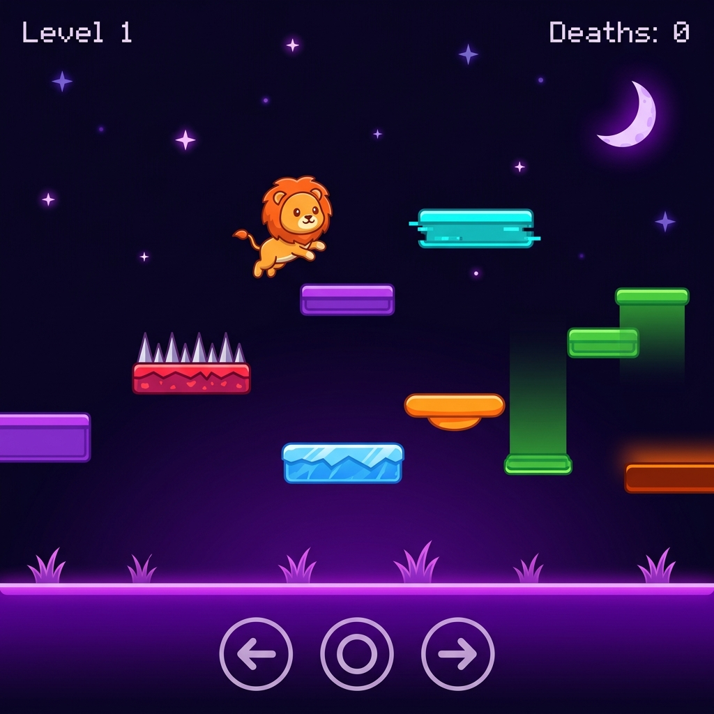

# 🦁 Glitch Grove

A 2D troll platformer where the environment is a liar. You play as a bouncy lion navigating a neon-pastel grove full of platforms that betray you at every turn.

**[▶ Play it live](https://YOUR-USERNAME.github.io/glitch-grove/)** ← replace `YOUR-USERNAME` with your GitHub username after deploying



> **🚀 Ready for GitHub Pages — just push and enable Pages in your repo Settings!**

---

## Gameplay

Use **← → Arrow Keys** (or **A / D**) to move and **Space / ↑ / W** to jump.

On mobile, tap the on-screen buttons.

### Platform Types

| Color | Type | Effect |
|-------|------|--------|
| 🟣 Purple | Safe | Normal solid platform |
| 🔴 Red | Spikes | Instant death on touch |
| 🔵 Cyan | Fake | Looks solid — phases you through, instant death |
| 🔵 Blue | Ice | You land but slide uncontrollably |
| 🟠 Orange | Bounce | Launches you violently upward |
| 🟢 Green | Vanish | Warns you with a flashing `!` then disappears |
| 🟤 Dark orange | Hot | Burns you dead after ~0.6 seconds of standing |

---

## Levels

| Level | Theme |
|-------|-------|
| 1 | Tutorial — vanishing platform introduction |
| 2 | Ice + spikes combo |
| 3 | Bounce pads + vanishing platforms |
| 4 | Hot floors + fake platforms |
| 5 | Full chaos — all trap types |

---

## Project Structure

```
glitch-grove/
├── index.html          # Entry point
├── css/
│   └── style.css       # All styles
├── js/
│   ├── levels.js       # Level data definitions
│   ├── lion.js         # Lion character drawing
│   ├── platforms.js    # Platform rendering & collision
│   ├── particles.js    # Particle system
│   └── game.js         # Main game loop & physics
└── README.md
```

---

## Running Locally

No build tools needed — it's plain HTML, CSS, and JavaScript.

```bash
git clone https://github.com/YOUR-USERNAME/glitch-grove.git
cd glitch-grove
```

Then open `index.html` directly in your browser — no build step needed.

Or use a local server:
```bash
npx serve .
```

---

## Deploying to GitHub Pages

1. Create a new repo on GitHub named `glitch-grove` (keep it public).
2. In your local project folder, run:
   ```bash
   git init
   git add .
   git commit -m "Initial commit — Glitch Grove 🦁"
   git branch -M main
   git remote add origin https://github.com/YOUR-USERNAME/glitch-grove.git
   git push -u origin main
   ```
3. On GitHub go to **Settings → Pages**.
4. Set **Source** to `Deploy from a branch`, branch = `main`, folder = `/ (root)`.
5. Click **Save** — your game is live at `https://YOUR-USERNAME.github.io/glitch-grove/` within ~60 seconds.

> The `.nojekyll` file in this repo ensures GitHub Pages serves all files correctly.

---

## Tech Stack

- **Vanilla JavaScript** — no frameworks, no build step
- **HTML5 Canvas** — all rendering via `CanvasRenderingContext2D`
- **CSS3** — layout and on-screen controls

---

## License

MIT — do whatever you want with it.
